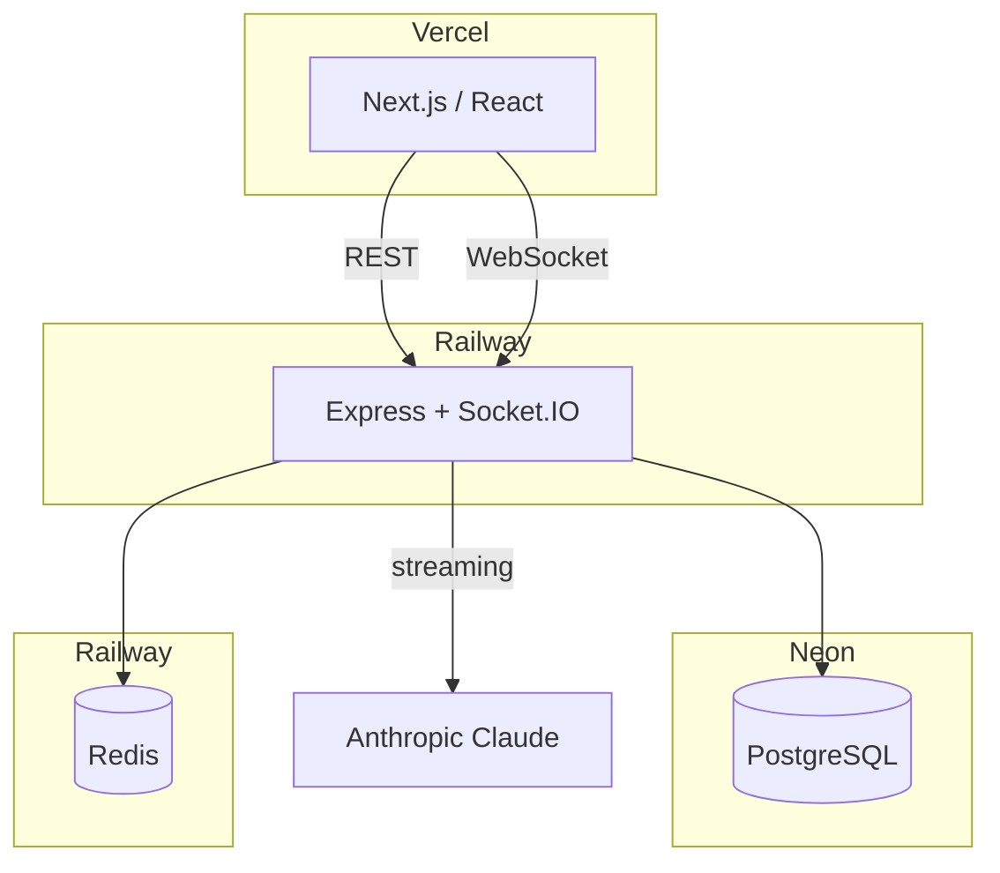
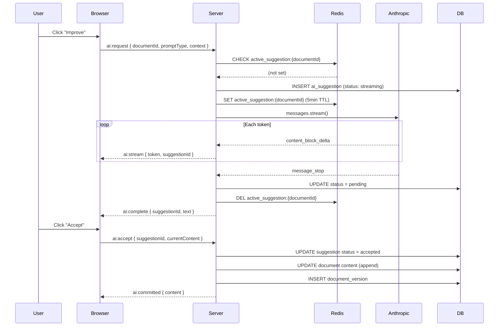
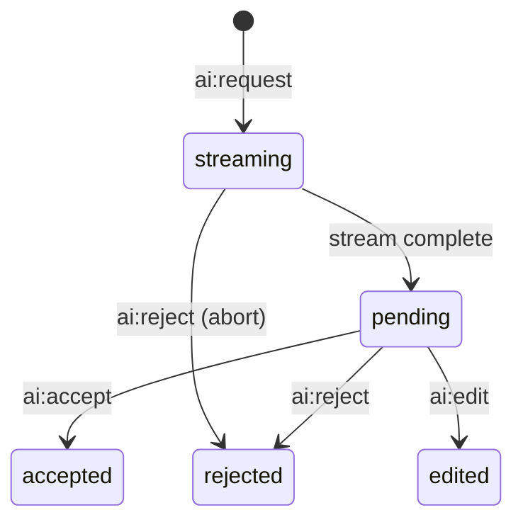
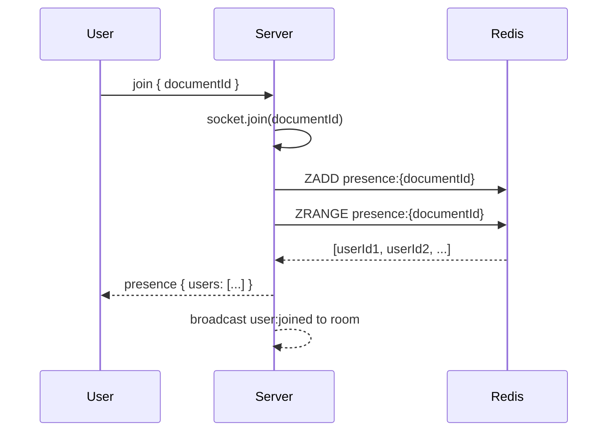
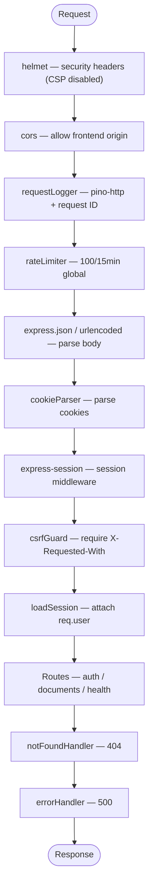

# Real-time AI Collaboration — Technical Overview

## Table of Contents

1. [Project Context](#1-project-context)
2. [Architecture Overview](#2-architecture-overview)
3. [Tech Stack](#3-tech-stack)
4. [Package Inventory](#4-package-inventory)
5. [Repository Structure](#5-repository-structure)
6. [Database Schema](#6-database-schema)
7. [API Reference](#7-api-reference)
8. [Socket.IO Events](#8-socketio-events)
9. [System Design Deep Dives](#9-system-design-deep-dives)
   - [Human-in-the-Loop AI Suggestions](#91-human-in-the-loop-ai-suggestions)
   - [Real-Time Collaboration](#92-real-time-collaboration)
   - [Authentication](#93-authentication)
10. [Middleware Stack](#10-middleware-stack)
11. [Frontend Architecture](#11-frontend-architecture)
12. [Deployment](#12-deployment)
13. [Architectural Decisions](#13-architectural-decisions)

---

## 1. Project Context

This is App 6 in a portfolio of eight progressive full-stack AI applications. Its primary purpose is to demonstrate **human-in-the-loop (HITL) AI interaction** combined with **real-time collaboration via Socket.IO**. Users don't just get AI output — they review, edit, and approve it before it touches the document.

The application is a collaborative writing workspace where multiple users edit shared documents in real time, with AI-powered writing suggestions that stream token-by-token through Socket.IO (not SSE).

---

## 2. Architecture Overview



**Deployment targets:**

- Frontend → Vercel (Next.js serverless)
- API server + Socket.IO → Railway (Node.js)
- Database → Neon (serverless PostgreSQL)
- Presence/Cursors/Locks → Railway (Redis)

---

## 3. Tech Stack

| Layer                  | Technology       | Version                   | Notes                                          |
| ---------------------- | ---------------- | ------------------------- | ---------------------------------------------- |
| **Frontend framework** | Next.js          | 15.x                      | App Router                                     |
| **UI library**         | React            | 19.x                      | Server + client components                     |
| **Rich text editor**   | Tiptap           | 2.x                       | ProseMirror-based, extensible                  |
| **Language**           | TypeScript       | 5.x                       | Strict mode                                    |
| **API server**         | Express          | 5.x                       | Async error propagation built-in               |
| **Real-time**          | Socket.IO        | 4.x                       | WebSocket with HTTP fallback                   |
| **Runtime**            | Node.js          | ≥ 20.0                    | Required by both packages                      |
| **Database**           | PostgreSQL       | 13+                       | Hosted on Neon (serverless)                    |
| **Cache/Presence**     | Redis            | —                         | Hosted on Railway, via ioredis                 |
| **LLM**                | Anthropic Claude | claude-haiku-4-5-20251001 | Streaming via SDK                              |
| **Auth**               | Custom sessions  | —                         | bcryptjs + express-session + connect-pg-simple |
| **Logging**            | Pino             | 10.x                      | JSON in prod, pino-pretty in dev               |
| **Validation**         | Zod              | 4.x                       | Schemas for all request bodies                 |
| **Data fetching**      | TanStack Query   | 5.x                       | Server state management                        |
| **Package manager**    | pnpm             | 9.x                       | Workspaces monorepo                            |

---

## 4. Package Inventory

### Server

**Runtime dependencies:**

| Package                        | Purpose                                                  |
| ------------------------------ | -------------------------------------------------------- |
| `@anthropic-ai/sdk`            | Streaming Claude API calls with AbortController support  |
| `@google-cloud/secret-manager` | Fetches secrets from GCP Secret Manager in production    |
| `bcryptjs`                     | Password hashing with 12 salt rounds                     |
| `connect-pg-simple`            | Stores express-session sessions in PostgreSQL            |
| `cookie-parser`                | Parses HTTP cookies into `req.cookies`                   |
| `cors`                         | Cross-origin resource sharing middleware                 |
| `dotenv`                       | Loads `.env` file into `process.env`                     |
| `express`                      | HTTP framework (v5)                                      |
| `express-rate-limit`           | In-memory rate limiting                                  |
| `express-session`              | Session middleware                                       |
| `helmet`                       | Security headers (CSP disabled for Socket.IO)            |
| `ioredis`                      | Redis client for presence, cursors, and suggestion locks |
| `node-pg-migrate`              | Database migrations                                      |
| `pg`                           | PostgreSQL client and connection pool                    |
| `pino` / `pino-http`           | Structured logging                                       |
| `socket.io`                    | WebSocket server for real-time events                    |
| `zod`                          | Runtime schema validation                                |

### Web Client

| Package                                        | Purpose                                 |
| ---------------------------------------------- | --------------------------------------- |
| `next`                                         | React framework with App Router and SSR |
| `react` / `react-dom`                          | UI library                              |
| `@tiptap/react` / `@tiptap/starter-kit`        | Rich text editor                        |
| `@tanstack/react-query`                        | Server state management                 |
| `socket.io-client`                             | WebSocket client for real-time events   |
| `sass`                                         | SCSS compilation                        |
| `@vercel/analytics` / `@vercel/speed-insights` | Performance monitoring                  |

---

## 5. Repository Structure

This is a pnpm monorepo with two workspace packages: `server` and `web-client`.

```
realtime-ai-collaboration/
├── package.json                    # Workspace root
├── pnpm-workspace.yaml
├── pnpm-lock.yaml
│
├── docs/
│   ├── SUMMARY.md
│   └── TECHNICAL_OVERVIEW.md
│
├── packages/
│   ├── server/
│   │   ├── package.json
│   │   ├── tsconfig.json
│   │   ├── migrations/
│   │   │   ├── ..._create-users-table.js
│   │   │   ├── ..._create-documents-table.js   # documents + document_collaborators
│   │   │   ├── ..._create-ai-tables.js         # ai_suggestions + document_versions
│   │   │   └── ..._create-sessions-table.js
│   │   └── src/
│   │       ├── index.ts                # Entry point: load secrets → start server
│   │       ├── app.ts                  # Express + Socket.IO setup
│   │       ├── config/                 # env, redis, corsConfig, secrets
│   │       ├── constants/              # session cookie name, TTL
│   │       ├── db/pool/                # PostgreSQL pool + query helpers
│   │       ├── handlers/
│   │       │   ├── auth/auth.ts        # register, login, logout, me
│   │       │   └── documents/          # CRUD, share, versions, suggestions
│   │       ├── middleware/             # requireAuth, csrfGuard, errorHandler, rateLimiter
│   │       ├── prompts/               # continue, improve, summarize, expand templates
│   │       ├── repositories/
│   │       │   ├── auth/              # User + session DB operations
│   │       │   ├── documents/         # Document CRUD, collaborators, share tokens
│   │       │   └── suggestions/       # AI suggestion CRUD, versions
│   │       ├── routes/
│   │       │   ├── auth.ts            # Auth endpoint definitions
│   │       │   └── documents.ts       # Document endpoint definitions
│   │       ├── schemas/               # Zod validation (auth, document)
│   │       ├── services/
│   │       │   ├── auth.service.ts    # Auth business logic
│   │       │   └── suggestion.service.ts  # AI streaming + suggestion lifecycle
│   │       ├── socket/                # Socket.IO event handlers
│   │       │   ├── ai.ts             # ai:request, ai:accept, ai:reject, ai:edit
│   │       │   ├── edit.ts           # Document edit broadcasting
│   │       │   ├── cursor.ts         # Cursor position tracking
│   │       │   └── presence.ts       # User join/leave + presence snapshots
│   │       ├── types/                 # TypeScript declarations
│   │       └── utils/                 # Logger (Pino)
│   │
│   └── web-client/
│       ├── package.json
│       ├── next.config.ts
│       └── src/
│           ├── app/
│           │   ├── layout.tsx          # Root layout + Providers
│           │   ├── globals.scss        # Global styles + CSS variables
│           │   ├── page.tsx            # Home page (hero)
│           │   ├── login/              # Login form
│           │   ├── register/           # Registration form
│           │   ├── join/               # Share token join flow
│           │   ├── documents/[id]/     # Docs viewer (Summary, Technical Overview)
│           │   └── (protected)/
│           │       ├── layout.tsx      # Server-side auth check
│           │       ├── dashboard/      # Document list + create
│           │       └── documents/[id]/ # Document editor
│           ├── components/
│           │   ├── Editor/             # TiptapEditor, EditorToolbar, PresenceAvatars
│           │   ├── Suggestions/        # SuggestionOverlay, Controls, History
│           │   ├── ShareModal/         # Share link generation
│           │   ├── VersionHistory/     # Version snapshots UI
│           │   ├── CursorOverlay/      # Remote cursor display
│           │   ├── Toast/              # Toast notifications
│           │   ├── MarkdownViewer.tsx   # Markdown renderer with syntax highlighting
│           │   ├── MermaidDiagram.tsx   # Mermaid diagram renderer
│           │   └── Providers/          # TanStack Query, Analytics
│           ├── hooks/
│           │   ├── useSocket.ts        # Socket.IO connection management
│           │   ├── useSuggestion.ts    # Suggestion lifecycle state machine
│           │   ├── usePresence.ts      # User presence + cursor tracking
│           │   └── useToast.ts         # Toast notification state
│           ├── lib/
│           │   ├── api.ts             # apiFetch wrapper with CSRF + credentials
│           │   └── queryClient.ts     # TanStack Query config
│           └── types/                  # Shared TypeScript types
```

---

## 6. Database Schema

The database has six tables. All primary keys are UUIDs generated by PostgreSQL. Foreign keys use `ON DELETE CASCADE` throughout. An `updated_at` trigger fires on every UPDATE.

### `users`

```sql
CREATE TABLE users (
  id            UUID        PRIMARY KEY DEFAULT gen_random_uuid(),
  email         VARCHAR(255) NOT NULL UNIQUE,
  password_hash TEXT        NOT NULL,
  name          VARCHAR(255) NOT NULL,
  created_at    TIMESTAMPTZ DEFAULT NOW(),
  updated_at    TIMESTAMPTZ DEFAULT NOW()
);
-- Trigger: set_updated_at() fires on every UPDATE
```

### `documents`

```sql
CREATE TABLE documents (
  id          UUID        PRIMARY KEY DEFAULT gen_random_uuid(),
  owner_id    UUID        NOT NULL REFERENCES users(id) ON DELETE CASCADE,
  title       VARCHAR(255) NOT NULL DEFAULT 'Untitled',
  content     TEXT        NOT NULL DEFAULT '',
  share_token VARCHAR(64) UNIQUE,       -- 32-byte hex string for shareable links
  created_at  TIMESTAMPTZ DEFAULT NOW(),
  updated_at  TIMESTAMPTZ DEFAULT NOW()
);
-- Trigger: set_updated_at() fires on every UPDATE
```

### `document_collaborators`

```sql
CREATE TABLE document_collaborators (
  document_id UUID        NOT NULL REFERENCES documents(id) ON DELETE CASCADE,
  user_id     UUID        NOT NULL REFERENCES users(id) ON DELETE CASCADE,
  permission  VARCHAR(20) CHECK (permission IN ('edit', 'view', 'suggest')),
  PRIMARY KEY (document_id, user_id)
);
-- UPSERT on conflict (document_id, user_id)
```

### `ai_suggestions`

```sql
CREATE TABLE ai_suggestions (
  id              UUID        PRIMARY KEY DEFAULT gen_random_uuid(),
  document_id     UUID        NOT NULL REFERENCES documents(id) ON DELETE CASCADE,
  requested_by    UUID        NOT NULL REFERENCES users(id) ON DELETE CASCADE,
  prompt_type     VARCHAR(20) CHECK (prompt_type IN ('continue', 'improve', 'summarize', 'expand')),
  suggestion_text TEXT        DEFAULT '',
  status          VARCHAR(20) CHECK (status IN ('streaming', 'pending', 'accepted', 'rejected', 'edited')),
  resolved_by     UUID        REFERENCES users(id),
  created_at      TIMESTAMPTZ DEFAULT NOW(),
  updated_at      TIMESTAMPTZ DEFAULT NOW()
);
```

### `document_versions`

```sql
CREATE TABLE document_versions (
  id               UUID        PRIMARY KEY DEFAULT gen_random_uuid(),
  document_id      UUID        NOT NULL REFERENCES documents(id) ON DELETE CASCADE,
  content_snapshot  TEXT        NOT NULL,   -- Full document content at this version
  created_by       UUID        NOT NULL REFERENCES users(id) ON DELETE CASCADE,
  created_at       TIMESTAMPTZ DEFAULT NOW()
);
```

### `session` (connect-pg-simple)

```sql
CREATE TABLE session (
  sid    VARCHAR PRIMARY KEY,
  sess   JSON    NOT NULL,
  expire TIMESTAMP NOT NULL
);
CREATE INDEX ON session (expire);
```

---

## 7. API Reference

All routes require `Content-Type: application/json`. State-changing requests require `X-Requested-With: XMLHttpRequest` for CSRF protection. Authentication uses an HTTP-only session cookie (`sid`).

### Authentication

| Method | Path             | Auth | Description                                                                    |
| ------ | ---------------- | ---- | ------------------------------------------------------------------------------ |
| POST   | `/auth/register` | No   | Creates user + session. Body: `{ email, password, name }`. Returns `{ user }`. |
| POST   | `/auth/login`    | No   | Validates credentials, creates session. Returns `{ user }`.                    |
| POST   | `/auth/logout`   | No   | Destroys session, clears cookie. Returns 204.                                  |
| GET    | `/auth/me`       | Yes  | Returns `{ user }` for current session.                                        |

### Documents

| Method | Path             | Auth | Description                                                          |
| ------ | ---------------- | ---- | -------------------------------------------------------------------- |
| GET    | `/documents`     | Yes  | Lists user's own + collaborated documents.                           |
| POST   | `/documents`     | Yes  | Creates a new document. Body: `{ title? }`.                          |
| GET    | `/documents/:id` | Yes  | Returns a single document.                                           |
| PUT    | `/documents/:id` | Yes  | Updates title and/or content.                                        |
| DELETE | `/documents/:id` | Yes  | Deletes document (cascades to collaborators, suggestions, versions). |

### Sharing

| Method | Path                   | Auth | Description                                                          |
| ------ | ---------------------- | ---- | -------------------------------------------------------------------- |
| POST   | `/documents/:id/share` | Yes  | Generates or returns share token. Returns `{ shareUrl }`.            |
| POST   | `/documents/join`      | Yes  | Joins via share token. Body: `{ token }`. Adds user as collaborator. |

### Suggestions & Versions

| Method | Path                         | Auth | Description                                    |
| ------ | ---------------------------- | ---- | ---------------------------------------------- |
| GET    | `/documents/:id/suggestions` | Yes  | Lists suggestions. Optional `?status=` filter. |
| GET    | `/documents/:id/versions`    | Yes  | Lists version snapshots (newest first).        |

### Health

| Method | Path            | Auth | Description                                                     |
| ------ | --------------- | ---- | --------------------------------------------------------------- |
| GET    | `/health`       | No   | Returns `{ status: "ok" }`.                                     |
| GET    | `/health/ready` | No   | Queries DB; returns `{ status: "ok", db: "connected" }` or 503. |

---

## 8. Socket.IO Events

All real-time communication flows through Socket.IO. The server authenticates connections via `socket.handshake.auth.userId`.

### Client → Server

| Event        | Payload                                                    | Description                                           |
| ------------ | ---------------------------------------------------------- | ----------------------------------------------------- |
| `join`       | `documentId`                                               | Join document room, receive presence snapshot         |
| `edit`       | `{ documentId, content }`                                  | Broadcast text edit to all users in room              |
| `cursor`     | `{ documentId, position }`                                 | Broadcast cursor position (stored 30s in Redis)       |
| `ai:request` | `{ documentId, promptType, context }`                      | Request AI suggestion (blocked if one already active) |
| `ai:accept`  | `{ documentId, suggestionId, currentContent }`             | Accept suggestion, append to document, create version |
| `ai:reject`  | `{ documentId, suggestionId }`                             | Reject suggestion, abort streaming if in progress     |
| `ai:edit`    | `{ documentId, suggestionId, editedText, currentContent }` | Commit edited suggestion text                         |

### Server → Client

| Event          | Payload                          | Description                                                  |
| -------------- | -------------------------------- | ------------------------------------------------------------ |
| `presence`     | `{ users: [{ userId, color }] }` | Snapshot of online users (sent on join)                      |
| `user:joined`  | `{ userId, color }`              | User joined the document room                                |
| `user:left`    | `{ userId }`                     | User left the document room                                  |
| `edit`         | `{ content, userId }`            | Document edited by another user                              |
| `cursor`       | `{ userId, position, color }`    | Cursor position update from another user                     |
| `ai:stream`    | `{ token, suggestionId }`        | Streaming token from Claude                                  |
| `ai:complete`  | `{ suggestionId, text }`         | Streaming finished, suggestion now 'pending'                 |
| `ai:committed` | `{ content }`                    | Suggestion committed (accepted or edited) — all users update |
| `ai:rejected`  | `{ suggestionId }`               | Suggestion rejected                                          |
| `ai:error`     | `{ message }`                    | AI streaming failed                                          |

---

## 9. System Design Deep Dives

### 9.1 Human-in-the-Loop AI Suggestions

The core pattern: AI proposes, humans approve. No AI-generated content enters the document without explicit human action.

**End-to-end flow:**



**Suggestion status state machine:**



**One-suggestion-at-a-time constraint:**

```typescript
// Redis key prevents concurrent suggestions per document
const key = `active_suggestion:${documentId}`;
const existing = await redis.get(key);
if (existing) {
  socket.emit('ai:error', { message: 'A suggestion is already in progress' });
  return;
}
await redis.set(key, JSON.stringify({ suggestionId, requestedBy }), 'EX', 300);
```

The 5-minute TTL prevents deadlock if the server crashes mid-stream.

**Abort on reject:**

```typescript
const abortController = new AbortController();
// If user rejects while streaming, abort the API call
socket.on('ai:reject', () => abortController.abort());

const stream = anthropic.messages.stream(
  { model, messages, max_tokens, system },
  { signal: abortController.signal },
);
```

---

### 9.2 Real-Time Collaboration

**Presence tracking:**

| Redis Structure                                     | Purpose                              |
| --------------------------------------------------- | ------------------------------------ |
| `presence:{documentId}` (sorted set)                | Active user IDs with join timestamps |
| `cursors:{documentId}:{userId}` (string, 30s TTL)   | Last known cursor position + color   |
| `active_suggestion:{documentId}` (string, 5min TTL) | Lock for one-suggestion-at-a-time    |

**User join flow:**



**User color assignment:**

Colors are deterministic — derived from a hash of the user ID mapped to a 6-color palette. This means the same user always gets the same color across sessions.

**Remote edit handling (Tiptap):**

The editor uses an `isRemoteUpdate` flag to distinguish local edits from remote edits received via Socket.IO. This prevents feedback loops where a remote edit triggers a local `onUpdate` callback that would re-broadcast the same edit.

---

### 9.3 Authentication

Custom session-based authentication backed by PostgreSQL via `connect-pg-simple`.

**Session details:**

| Property    | Value                            |
| ----------- | -------------------------------- |
| Cookie name | `sid`                            |
| TTL         | 7 days                           |
| HttpOnly    | true                             |
| Secure      | true in production               |
| SameSite    | lax                              |
| Store       | PostgreSQL via connect-pg-simple |

**Password hashing:** bcryptjs with 12 salt rounds.

**Protected routes:** The Next.js `(protected)/layout.tsx` is a server component that fetches `/auth/me` using the request cookies. If the response is not OK, it redirects to `/login`.

**Socket.IO authentication:** Connections authenticate via `socket.handshake.auth.userId`. The server rejects connections without a userId.

---

## 10. Middleware Stack

Middleware is applied in this order for every HTTP request:



**CSP disabled:** Helmet's Content Security Policy is turned off because Socket.IO requires inline scripts and WebSocket connections that CSP would block by default.

---

## 11. Frontend Architecture

### Rich Text Editor (Tiptap)

The document editor is built on Tiptap 2, a headless ProseMirror wrapper. It provides:

- Standard formatting (bold, italic, headings, lists, code blocks)
- Custom toolbar component with formatting buttons
- Remote edit handling via `isRemoteUpdate` flag
- Cursor position tracking for presence display

### Suggestion UI

Three components manage the AI suggestion lifecycle:

- **SuggestionOverlay** — displays streaming tokens in a highlighted overlay
- **SuggestionControls** — Accept/Edit/Reject buttons (visible only to requester)
- **SuggestionHistory** — lists past suggestions with their statuses

### Custom Hooks

| Hook            | Purpose                                                                 |
| --------------- | ----------------------------------------------------------------------- |
| `useSocket`     | Manages Socket.IO connection lifecycle, reconnection                    |
| `useSuggestion` | Tracks suggestion state machine (idle → streaming → pending → resolved) |
| `usePresence`   | Tracks online users and cursor positions                                |
| `useToast`      | Manages toast notification queue                                        |

### State Management

- **TanStack React Query** — document list, user session
- **React useState** — editor content, suggestion state, UI state
- **Socket.IO events** — real-time updates bypass React Query entirely

---

## 12. Deployment

### Server (Railway)

Deployed as a Node.js service on Railway. Socket.IO runs on the same port as the Express HTTP server.

### Frontend (Vercel)

Next.js deployed to Vercel. Environment variables set:

- `NEXT_PUBLIC_API_URL` — Railway API URL
- `NEXT_PUBLIC_WS_URL` — Railway WebSocket URL (same as API URL)

### Environment Variables

**Server:**

| Variable            | Required   | Description                                        |
| ------------------- | ---------- | -------------------------------------------------- |
| `DATABASE_URL`      | Yes        | PostgreSQL connection string (Neon)                |
| `REDIS_URL`         | Yes        | Redis connection string (presence, cursors, locks) |
| `ANTHROPIC_API_KEY` | Yes        | Claude API key                                     |
| `SESSION_SECRET`    | Yes        | Secret for signing session cookies                 |
| `CORS_ORIGIN`       | Yes (prod) | Frontend URL                                       |
| `NODE_ENV`          | No         | Set to `production` on Railway                     |
| `PORT`              | No         | HTTP port (default: 3001)                          |
| `GCP_PROJECT_ID`    | No         | GCP project for Secret Manager                     |
| `GCP_SA_JSON`       | No         | GCP service account credentials JSON               |

**Web Client:**

| Variable              | Required | Description                             |
| --------------------- | -------- | --------------------------------------- |
| `NEXT_PUBLIC_API_URL` | Yes      | API base URL                            |
| `NEXT_PUBLIC_WS_URL`  | Yes      | WebSocket URL (usually same as API URL) |

---

## 13. Architectural Decisions

### Socket.IO over SSE for AI Streaming

Earlier apps (2, 4) use Server-Sent Events for streaming. This app uses Socket.IO because:

1. The app already requires WebSockets for collaborative editing and presence
2. AI suggestions need to be broadcast to all users in a room, not just the requester
3. Socket.IO's room abstraction maps naturally to documents
4. Bidirectional communication is needed for accept/reject/edit actions during streaming

### Claude Haiku over Sonnet

This app uses `claude-haiku-4-5-20251001` instead of Sonnet because writing suggestions need to be fast and cheap. Users request suggestions frequently during editing — latency matters more than maximum quality for continue/improve/summarize/expand operations.

### One Suggestion at a Time

The Redis-based lock (`active_suggestion:{documentId}`) prevents concurrent suggestions per document. This simplifies the UI (only one overlay at a time), prevents conflicting edits, and keeps the document state predictable for all collaborators.

### Version Snapshots on Accept/Edit Only

Versions are created only when a suggestion is committed (accepted or edited), not on every keystroke. This keeps the version history meaningful — each entry represents a deliberate AI-assisted change, not noise from typing.

### Tiptap over Contenteditable

Tiptap (ProseMirror) provides a structured document model, making it straightforward to apply remote edits without corrupting the editor state. Raw `contenteditable` would require custom operational transform logic to handle concurrent edits correctly.

### Deterministic User Colors

User colors are derived from a hash of the user ID, not assigned randomly. This means a user always has the same color in every document and every session — making it easier to recognize collaborators at a glance.

### Fail-Open Redis

Like other apps in the portfolio, Redis is treated as optional infrastructure for the core CRUD operations. If Redis is unavailable, presence tracking and cursor sharing degrade silently. The suggestion lock also fails open — worst case, two suggestions could run concurrently, which is handled gracefully by the UI.

### Server-Side Auth Check in Layout

The `(protected)/layout.tsx` is a Next.js server component that checks authentication by calling `/auth/me` with the request cookies. This catches unauthenticated users before any client-side JavaScript runs, preventing a flash of protected content.

### Express 5 with Async Error Propagation

Express 5 automatically catches errors thrown in async route handlers. Combined with the centralized `errorHandler` middleware, this eliminates try/catch boilerplate in every handler.
